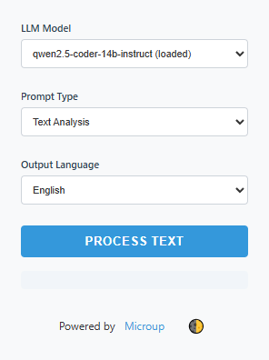

# LM Studio Assistant

Link: [WEB Chrome extension](https://chromewebstore.google.com/detail/lm-studio-assistant/iefmcbandkegenedffmjefjjnccohnke)

LM Studio Assistant is a powerful web extension for Chrome and Edge designed to enhance your text analysis, code review, translation, and other language processing tasks. This tool leverages the capabilities of LM Studio models for local processing, ensuring maximum privacy and security.

<p align="center">
  
</p>

## Features

* Local Processing: All data is processed locally on your machine using LM Studio. No data is sent to external servers.
* Privacy First: Your text and code are kept secure and confidential. The extension does not transmit any information over the internet.
* Versatile Analysis: Supports multiple prompt types including Text Analysis, Translation, Code Review, Text Simplification, and Grammar Correction.
* Multi-Language Support: Output in either English or Russian based on your preference.

## Installation

1. Download and Install LM Studio

* Visit [LM Studio](https://lmstudio.ai/) to download the application.
* Follow the installation instructions provided on the website.

2. Clone the Repository:

```bash
git clone https://github.com/microup/LM-Studio-Assistant.git
```

3. Load the Extension:
* Open your browser (Chrome or Edge) and navigate to `chrome://extensions/` (or `edge://extensions/` for Edge)
* Enable "Developer mode" using the toggle in the top right.
* Click on "Load unpacked" and select the cloned repository directory.
*Start LM Studio: Ensure that LM Studio is running locally on your machine, as it provides the necessary models for analysis.

## Usage

1. Open a Web Page: Open any web page you want to analyze in Chrome or Edge.
2. Select Text (Optional): You can either highlight the text you wish to analyze or leave it blank to process the entire page content.
3. Choose Prompt Type: Select the desired prompt type from the dropdown menu. Available prompts include:
    * Text Analysis: Analyze the highlighted text, extract important points, and create an analytical summary.
    * Translation: Translate the highlighted text into the selected language.
    * Code Review: Review the code, identify errors, suggest optimizations, and check for adherence to coding style.
    * Text Simplification: Simplify the text for better understanding while preserving key ideas.
    * Grammar Correction: Correct any errors in the text while maintaining writing style.
4. Specify Output Language: Choose the output language for the analysis results.
5. Select LLM Model: Choose the appropriate LM Studio model from the list.
6. Click "Process Text": The extension will analyze the text using the selected model and display the results in the designated section.

## Security

Privacy is a top priority with this extension. All text and code are processed locally on your machine, ensuring that no sensitive information is transmitted to external servers. This design guarantees complete security and control over your data.

## Contributing
We welcome contributions from the community! If you have any suggestions or would like to enhance the functionality of LM Studio Assistant, please fork the repository and submit a pull request.

## License

This project is licensed under the MIT License.
